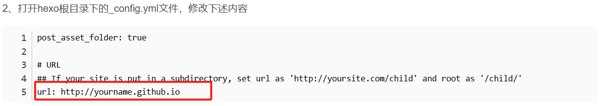

最近学习前端优化刷到一篇博客，[前端不删](https://godbasin.github.io/front-end-playground/front-end-work/front-end-days/a-book-with-one-story.html#%E8%BD%AC%E5%9C%BA%E7%94%B5%E5%AD%90%E4%B9%A6)，然后我就去部署自己的 github.io 了

……没错，学着学着玩儿起来了

[GitHub Pages + Hexo 搭建个人博客网站，史上最全教程](https://blog.csdn.net/yaorongke/article/details/119089190)

主要参考这个文章进行部署，其他都没啥问题但是我的 hexo 图片显示有问题

我设置了`post_asset_folder: true` 使用相对路劲来显示不管怎么样都没有成功

f12 查看 页面图片路径好像解析的时候有问题，他总会在路径前面加一个/

我本地路径为``,线上图片如下: `/imge.png`

同理正常情况下的路径：``显示出来就是`/./image.png`

安装这个插件：`npm install hexo-asset-image --save`

使用这个方式来插入图片：``

---

2.10 更新

又不可以了，今天更新文章，发现``插入图片又出了问题，并且之前的文章里面的也有问题了，而且这个方法在写 markdown 的时候太麻烦了

参考这个设置：[Hexo 使用 markdown 插入图片无法显示解决方法](https://blog.csdn.net/m0_55037604/article/details/113460538)

---

神经吧有时候可以有时候不可以

---

破案了，Markdown 的图片格式得为``
