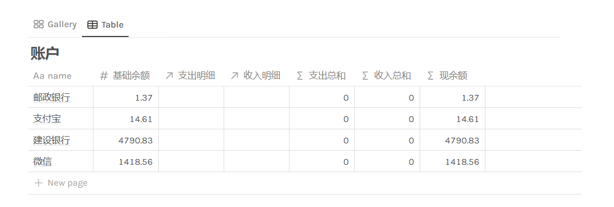
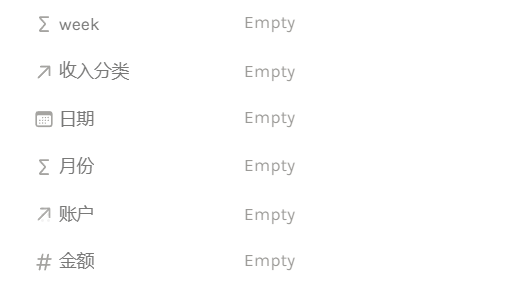
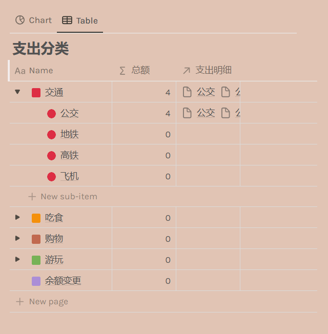
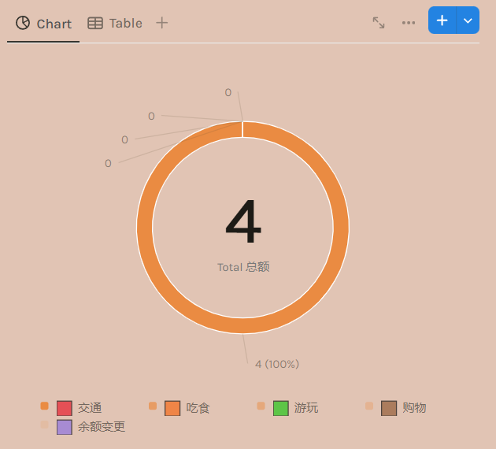

# 记账工具

### 模板文件

<aside>

[账本模板](https://jueer33.notion.site/1a54cdfbb24080e3af60dc620b24dd2e?pvs=74)

</aside>

### 模板介绍

总共分为三个大板块，账户，收入明细，支出明细。

1. 账户部分直接设置基础余额就可以在增加收入和支出的时候自动创建数据，当然也可以添加任意的账户信息，比如其他银行

2. 支出明细部分，表格一共有以下的属性其中 week 和月份会根据日期自动计算，账户点击可以选择账户表格部分的账户类型，同时会将支出数据和明细同步到账户中，**收入明细部分同理**

3. 在支出明细和收入明细部分都有一个属性为支出分类/收入分类，这两个对应的表如下，其中方框图标为一级分类，圆形图标为二级分类，在该列表中可以统计每个类别的支出/收入总额度。此外每个分类表格都有 chart 图表方便直观看到分类收支情况

4. 中间有个多维度板块，可以从多个时间段看到收支情况

5. 快速创建部分我目前增加了一部分可能遇到的情况，公交为具体金额，直接插入今日支出，记一笔支出/收入按钮点击直接新建今日支出/收入并打开表格，加减余额用于余额变更(做假账哈哈哈哈)

