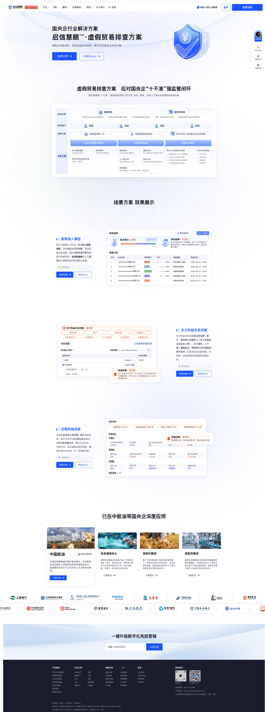

# 汇总

| Name             | 语言                                                  | 网址                                                        | 费用      | 备注                    |
| ---------------- | ----------------------------------------------------- | ----------------------------------------------------------- | --------- | ----------------------- |
| Readdy.ai        | vue+Tailwind                                          | https://readdy.ai/home/f5c4d43b-e3de-47de-bdf8-144afd33654e | 有额度    |                         |
| copyweb.ai       | HTML+CSS, React                                       | https://copyweb.ai/                                         | 有额度    |                         |
| screenshottocode | HTML+CSS, HTML+Tailwind, React+Tailwind, vue+Tailwind | https://screenshottocode.com/                               | 要钱      |                         |
| ScriptEcho       | HTML, Vue3                                            | https://scriptecho.cn/                                      |           | 也是用的 Tailwind CSS   |
| vue0             |                                                       | https://www.vue0.dev/                                       | 要有 gpt4 | 只能根据提示词生成      |
| anima            | React, Tailwind, Vue, vue+Tailwind                    | https://www.animaapp.com/                                   | 有额度    | 在 figma 中作为插件使用 |
| builder          | React, Tailwind, Vue                                  | https://www.builder.io/                                     | 有额度    | 在 figma 中作为插件使用 |

# Readdy.ai

网址: https://readdy.ai/home/f5c4d43b-e3de-47de-bdf8-144afd33654e
语言: vue+Tailwind
费用: 有额度

<aside>

### 文章逻辑

1. 一级标题是进行生成的思路
2. 每个二级标题下面的输入图片是一样的
3. 三级标题（第一轮，第二轮）每一轮的意思是新开一个对话，同一轮下面的结果是在一个对话里面得到的
4. 效果比较好的部分我在**项目中的实际效果**前面加了 ⚠️
</aside>

<aside>

### 总结：

1. 这个 ai 上下文的理解能力比较差，不太能基于之前提示词和之前的代码来进行生成和修改，只能基于之前的生成图来进行生成
2. 默认 css 一定使用**Tailwind CSS，**要在提示中加上不要使用**Tailwind CSS**
3. 由于没有很多的上下文理解能力，对于我需要让他基于我已有的公共组件来进生成就比较困难，唯一一次生成的比较好的使用公共组件是我给了具体的一个样例
4. 在生成样式确实比较还原，但是没有精确到每一个颜色，距离，这些精细的部分还需要手动调整，这样的话如果是很简单的部分让生成效率不如自己写，比较多的部分样式生成后自己再调效率确实可以有提升（要注意图像大小不能太大）

> 如果是我，我会选择公共组件部分随便它生成，只起个占位作用，具体公共组件用法还是得问其他的 ai 工具，会考虑把一些元素比较多的静态的页面给他，然后我基于这个页面来进行修改

</aside>

## 1、上传整个设计稿

###### 上传图片



###### 提示词

这是我的页面设计稿，我需要你帮我完成我的页面设计，

1. 顶部的导航栏部分全部都是我们的公共组件，可以直接调用，你可以不用实现
2. 下方的 footer 部分也是公共组件，可以直接调用，你也可以不用实现
3. 你可以发现我的网页全部都是居中布局的，并且中间部分是固定宽度 1200px。 这部分我们也有公共组件实现布局，我希望你可以用这个，类似下面这种用法，这样不用专门设置样式居中，同时可以设计是什么布局

```jsx
  <ui-box class="box-1" :colCount="2" :column="false" padding="95px 0 " background-color="transparent">
	<div class="headers">
	  <h2>国央企行业解决方案</h2>
	  <h1>启信慧眼™·虚假贸易排查方案</h1>
	  <p class="text">模板化排查规则、特定利益关系挖掘、单次1000家企业关系计算</p>

	  <div class="button-box">
		<app-common-btn class="free-btn" entry="header-免费试用" type="primary" padding="8px 20px" text="免费试用" width="180px" :icon="rightArrow" />
		<app-common-btn class="demo-btn" entry="header-体验Demo" type="primary" padding="8px 20px" text="体验Demo" width="180px" :icon="rightArrow" />
	  </div>
	</div>
  </ui-box>
```

1. 我的有很多按钮，这些按钮都是公共组件我在使用的时候需要进行样式的重新设计，类似下面这种

```jsx
	<app-common-btn class="demo-btn" entry="header-体验Demo" type="primary" padding="8px 20px" text="体验Demo" width="180px" :icon="rightArrow" />
  ::v-deep(.demo-btn .el-button) {
	display: flex;
	justify-content: center;
	align-items: center;
	height: 60px;
	border-radius: 4px;
	font-size: 20px;
	color: $color-secondary-500;
	background-color: transparent;
	border-color: $color-secondary-500;

  }

```

1. 设计稿中中间有几大部分都是图片，你可以不用管图片的具体内容，只需要帮我把图片的布局样式设计好
2. 我希望所有的代码严格遵守规范，模板里面尽量少的数据，样式全部写在 style 里面，其中，style 中 css 我们使用的是 scss 来写

<aside>

图片大小有将近 5mb，他生成不出，过了五分钟都没有任何反应

</aside>

## 2、分为每个部分生成

### 2.1 头部

###### 上传的图片：


#### 2.1.1 第一轮

###### 提示词

这是我的页面设计稿，我需要你帮我完成我的页面设计，

1. 顶部的导航栏部分全部都是我们的公共组件，可以直接调用，你可以不用实现
2. 下方的 footer 部分也是公共组件，可以直接调用，你也可以不用实现
3. 你可以发现我的网页全部都是居中布局的，并且中间部分是固定宽度 1200px。 这部分我们也有公共组件实现布局，我希望你可以用这个，类似下面这种用法，这样不用专门设置样式居中，同时可以设计是什么布局

   ```jsx
   	  <ui-box class="box-1" :colCount="2" :column="false" padding="95px 0 " background-color="transparent">
   		<div class="headers">
   		  <h2>国央企行业解决方案</h2>
   		  <h1>启信慧眼™·虚假贸易排查方案</h1>
   		  <p class="text">模板化排查规则、特定利益关系挖掘、单次1000家企业关系计算</p>

   		  <div class="button-box">
   			<app-common-btn class="free-btn" entry="header-免费试用" type="primary" padding="8px 20px" text="免费试用" width="180px" :icon="rightArrow" />
   			<app-common-btn class="demo-btn" entry="header-体验Demo" type="primary" padding="8px 20px" text="体验Demo" width="180px" :icon="rightArrow" />
   		  </div>
   		</div>
   	  </ui-box>
   ```

4. 我的有很多按钮，这些按钮都是公共组件我在使用的时候需要进行样式的重新设计，类似下面这种

   ```jsx
   			<app-common-btn class="demo-btn" entry="header-体验Demo" type="primary" padding="8px 20px" text="体验Demo" width="180px" :icon="rightArrow" />
   		  ::v-deep(.demo-btn .el-button) {
   			display: flex;
   			justify-content: center;
   			align-items: center;
   			height: 60px;
   			border-radius: 4px;
   			font-size: 20px;
   			color: $color-secondary-500;
   			background-color: transparent;
   			border-color: $color-secondary-500;

   		  }

   ```

5. 设计稿中中间有几大部分都是图片，你可以不用管图片的具体内容，只需要帮我把图片的布局样式设计好
6. 我希望所有的代码严格遵守规范，模板里面尽量少的数据，样式全部写在 style 里面，其中，style 中 css 我们使用的是 scss 来写

下面我分为每个部分给你我的设计稿，请你帮我依次完成每个部分

###### 生成代码

```jsx
<!-- The exported code uses Tailwind CSS. Install Tailwind CSS in your dev environment to ensure all styles work. -->

<template>
  <div class="page">
	<ui-box
	  class="hero-section"
	  :colCount="2"
	  :column="false"
	  padding="95px 0"
	  background-color="transparent"
>
	  <div class="hero-content">
		<h2 class="hero-subtitle">国央企行业解决方案</h2>
		<h1 class="hero-title">启信慧眼™·虚假贸易排查方案</h1>
		<p class="hero-desc">模板化排查规则、特定利益关系挖掘、单次 1000 家企业关系计算</p>
		<div class="hero-buttons">
		  <app-common-btn
			class="free-trial-btn"
			entry="header-免费试用"
			type="primary"
			padding="8px 20px"
			text="免费试用"
			width="180px"
		  />
		  <app-common-btn
			class="demo-btn"
			entry="header-体验Demo"
			type="primary"
			padding="8px 20px"
			text="体验 Demo"
			width="180px"
		  />
		</div>
	  </div>
	  <div class="hero-image">
		
	  </div>
	</ui-box>
  </div>
</template>

<script>
export default {
  name: 'App',
  data() {
	return {};
  }
};
</script>

<style lang="scss" scoped>
.page {
  min-height: 100vh;
  background-color: #fff;
}

.hero-section {
  position: relative;
  overflow: hidden;
}

.hero-content {
  max-width: 600px;
  z-index: 1;
}

.hero-subtitle {
  font-size: 20px;
  color: #333;
  margin-bottom: 16px;
  font-weight: 500;
}

.hero-title {
  font-size: 36px;
  font-weight: bold;
  color: #1a1a1a;
  margin-bottom: 24px;
  line-height: 1.3;
}

.hero-desc {
  font-size: 16px;
  color: #666;
  margin-bottom: 40px;
  line-height: 1.6;
}

.hero-buttons {
  display: flex;
  gap: 20px;
}

.hero-image {
  display: flex;
  justify-content: center;
  align-items: center;

  .shield-icon {
	width: 100%;
	max-width: 400px;
	height: auto;
	object-fit: contain;
  }
}

::v-deep(.free-trial-btn .el-button) {
  display: flex;
  justify-content: center;
  align-items: center;
  height: 60px;
  border-radius: 4px;
  font-size: 20px;
  color: #fff;
  background-color: #4080ff;
  border: none;
  transition: all 0.3s ease;

  &:hover {
	background-color: darken(#4080ff, 10%);
  }
}

::v-deep(.demo-btn .el-button) {
  display: flex;
  justify-content: center;
  align-items: center;
  height: 60px;
  border-radius: 4px;
  font-size: 20px;
  color: #4080ff;
  background-color: transparent;
  border: 2px solid #4080ff;
  transition: all 0.3s ease;

  &:hover {
	background-color: rgba(64, 128, 255, 0.1);
  }
}
</style>

```

###### **⚠️ 项目中的实际效果**


###### 提示词

你有没有发现我的设计稿上面的免费试用和体验 demo 按钮上面都有箭头，请帮我继续完善

###### 生成代码

```jsx
<!-- The exported code uses Tailwind CSS. Install Tailwind CSS in your dev environment to ensure all styles work. -->

<template>
  <div class="page">
	<div class="hero-section flex justify-between items-center px-24 py-24 max-w-[1440px] mx-auto">
	  <div class="hero-content max-w-[600px]">
		<h2 class="text-xl text-gray-700 font-medium mb-4">国央企行业解决方案</h2>
		<h1 class="text-4xl font-bold text-gray-900 mb-6 leading-tight">启信慧眼™·虚假贸易排查方案</h1>
		<p class="text-lg text-gray-600 mb-10 leading-relaxed">模板化排查规则、特定利益关系挖掘、单次 1000 家企业关系计算</p>
		<div class="flex gap-6">
		  <button
			class="!rounded-button whitespace-nowrap flex items-center justify-center bg-blue-600 hover:bg-blue-700 text-white px-8 py-4 text-lg font-medium transition-all duration-300"
			@click="handleFreeTrial"
>
			免费试用
			<i class="fas fa-arrow-right ml-3 text-lg"></i>
		  </button>
		  <button
			class="!rounded-button whitespace-nowrap flex items-center justify-center border-2 border-blue-600 text-blue-600 hover:bg-blue-50 px-8 py-4 text-lg font-medium transition-all duration-300"
			@click="handleDemo"
>
			体验 Demo
			<i class="fas fa-arrow-right ml-3 text-lg"></i>
		  </button>
		</div>
	  </div>
	  <div class="hero-image relative w-[500px] h-[500px] flex items-center justify-center">
		
	  </div>
	</div>
  </div>
</template>

<script>
export default {
  name: 'App',
  data() {
	return {
	  showDialog: false
	};
  },
  methods: {
	handleFreeTrial() {
	  this.showDialog = true;
	  // 这里可以添加免费试用的具体逻辑
	  console.log('点击了免费试用');
	},
	handleDemo() {
	  // 这里可以添加体验Demo的具体逻辑
	  console.log('点击了体验Demo');
	}
  }
};
</script>

<style scoped>
.page {
  min-height: 1024px;
  background-color: #ffffff;
}

.hero-section {
  position: relative;
  overflow: hidden;
  min-height: 600px;
}

button:hover i {
  transform: translateX(4px);
}

button i {
  transition: transform 0.3s ease;
}

/* 自定义按钮阴影效果 */
button {
  box-shadow: 0 2px 4px rgba(0, 0, 0, 0.05);
}

button:hover {
  box-shadow: 0 4px 8px rgba(0, 0, 0, 0.1);
}

/* 确保图标垂直对齐 */
.fas {
  line-height: 1;
  display: inline-flex;
  align-items: center;
}
</style>

```

###### 项目中的实际效果


<aside>

我给他的提示词是有部分公共组件的使用的，比如按钮的样式，在第一回的时候可以直接套模板给加上去，我提要求在按钮上面再加一个图标的时候，它会直接生成原生的代码，而不使用公共组件，无论我怎么强调要在原始的代码基础上面修改

</aside>

#### 2.1.2 第二轮

###### 提示词：

我分为两段话一段话做要求提示，一段话发送公共组件使用代码，然后进行生成
第一段话
这是我的设计稿 1. 顶部导航栏是我们公共组件，你可以不用管 2. 右边是个在线咨询的组件，你也可以不用管 3. 我的设计稿是居中对齐的，这部分是有专门的布局组件，等会我发你我们公共组件的布局组件 4. 设计稿中的按钮也是我们的公共组件 ，我可以给你一个使用的实例，
<app-common-btn class="free-btn" entry="header-免费试用" type="primary" padding="8px 20px" text="免费试用" width="180px" :icon="rightArrow" />
::v-deep(.free-btn .el-button) {
display: flex;
justify-content: center;
align-items: center;
height: 60px;
border-radius: 4px;
font-size: 20px;
color: $white;
background-color: $color-secondary-500;
border-color: $color-secondary-500;
i {
order: 1;
width: 16px;
height: 16px;
margin-left: 10px;
display: inline-block;
background-image: url('../../assets/image/w-false-trade/rightArrow1.png');
background-size: 16px auto;
background-position: center;
background-repeat: no-repeat;
}
}
我等会再发布局 的组件
第二段话

    UI-box的代码

###### 生成代码

````jsx
<!-- The exported code uses Tailwind CSS. Install Tailwind CSS in your dev environment to ensure all styles work. -->

```vue
<template>
  <div class="hero-section">
	<div class="container mx-auto px-4 py-20">
	  <div class="flex items-center justify-between">
		<div class="left-content w-1/2">
		  <h1 class="text-3xl font-bold mb-4">国央企行业解决方案</h1>
		  <h2 class="text-2xl mb-4">启信慧眼™·虚假贸易排查方案</h2>
		  <p class="text-gray-600 mb-8">模板化排查规则，特定利益关系图谱，兼容2000家企业实务计算</p>
		  <div class="flex gap-4">
			<button class="!rounded-button bg-blue-600 text-white px-8 py-4 flex items-center whitespace-nowrap">
			  免费试用
			  <i class="fas fa-arrow-right ml-2"></i>
			</button>
			<button class="!rounded-button border border-blue-600 text-blue-600 px-8 py-4 flex items-center whitespace-nowrap">
			  体验 Demo
			  <i class="fas fa-arrow-right ml-2"></i>
			</button>
		  </div>
		</div>
		<div class="right-content w-1/2 relative">
		  
		</div>
	  </div>
	</div>
  </div>
</template>

<script>
export default {
  name: 'HeroSection',
  data() {
	return {
	  shieldImageUrl: 'https://public.readdy.ai/ai/img_res/064f0cf8019146cc2cc63451716b0ec2.jpg'
	}
  }
}
</script>

<style scoped>
.hero-section {
  background: linear-gradient(to right, #ffffff, #f8faff);
  min-height: 600px;
}

.left-content h1 {
  color: #333;
  line-height: 1.2;
}

.left-content h2 {
  color: #444;
  line-height: 1.3;
}

.left-content p {
  line-height: 1.6;
}

button {
  transition: all 0.3s ease;
}

button:hover {
  transform: translateY(-2px);
}

.right-content img {
  max-width: 400px;
  margin: 0 auto;
}
</style>

````

###### 项目中的实际效果


<aside>

这个 AI 工具对前后文的语义连接没有很好，不能理解上下文的联系，只能根据设计稿和每次的提示来修改代码，不能根据我前后给出代码或者他之前生成代码来进行生成

</aside>

### 2.2

###### 设计稿


#### 2.2.1 第一轮

前面的布局有点简单，且大部分涉及公共组件，我不要求它基于组件来实现，直接实现原生的效果，要求代码风格

###### 提示词

这是我的设计稿，整体居中显示，中间的宽度为 1200px，下面的四列使用 flex 布局，当鼠标 hover 的时候整体卡片有一个放大的效果，放大时中间的图片文字都要变大，了解更多的按钮要变化颜色，放大时宽度可以超出 1200px

###### 生成代码

```jsx
<!-- The exported code uses Tailwind CSS. Install Tailwind CSS in your dev environment to ensure all styles work. -->

<template>
  <div class="min-h-screen bg-gray-50">
	<div class="container mx-auto px-4">
	  <h1 class="text-3xl font-bold text-center py-12">已在中航油等国央企深度应用</h1>

	  <div class="flex justify-between gap-6 max-w-[1200px] mx-auto">
		<!-- 中国航油 -->
		<div class="case-card group">
		  <div class="case-image-wrapper">
			
		  </div>
		  <h3 class="case-title">中国航油</h3>
		  <p class="case-desc">采用信息智能协作插件集成模式，将成熟的风控功能嵌入到集团内部各同类型系统中，提升集团成员及子公司业务人员日常风控效果。</p>
		  <button class="learn-more-btn">
			了解更多
			<i class="fas fa-arrow-right ml-2"></i>
		  </button>
		</div>

		<!-- 信息通信巨头 -->
		<div class="case-card group">
		  <div class="case-image-wrapper">
			
		  </div>
		  <h3 class="case-title">信息通信巨头</h3>
		  <p class="case-desc">使用信信智能关系挖掘方案，支持对供应商、客户、资金借企业、内部员工等多主体及其关联生体之间、相互多维度、深层次、自动化的关系挖掘。</p>
		  <button class="learn-more-btn">
			了解更多
			<i class="fas fa-arrow-right ml-2"></i>
		  </button>
		</div>

		<!-- 某粮农集团 -->
		<div class="case-card group">
		  <div class="case-image-wrapper">
			
		  </div>
		  <h3 class="case-title">某粮农集团</h3>
		  <p class="case-desc">基于"组与组挖掘"功能及强件集成新力，实现对交易对手的系统化、自动化合规管理，监测组织交易对手上下游之间是否存在特定利益关系。</p>
		  <button class="learn-more-btn">
			了解更多
			<i class="fas fa-arrow-right ml-2"></i>
		  </button>
		</div>

		<!-- 某医药集团 -->
		<div class="case-card group">
		  <div class="case-image-wrapper">
			
		  </div>
		  <h3 class="case-title">某医药集团</h3>
		  <p class="case-desc">使用信信智能集中指管医控检控查新创新型调理器，对路专业原的上下游关系进行深为序核全部调理器，相互中深度与客户之间是否存在关联关系。</p>
		  <button class="learn-more-btn">
			了解更多
			<i class="fas fa-arrow-right ml-2"></i>
		  </button>
		</div>
	  </div>
	</div>
  </div>
</template>

<script>
export default {
  name: 'App'
}
</script>

<style scoped>
.case-card {
  @apply bg-white rounded-lg shadow-md overflow-hidden flex-1 transition-all duration-300;
  max-width: 280px;
}

.case-card:hover {
  @apply shadow-xl;
  transform: scale(1.05);
  z-index: 10;
}

.case-image-wrapper {
  @apply w-full h-48 overflow-hidden;
}

.case-image {
  @apply w-full h-full object-cover transition-transform duration-300;
}

.case-card:hover .case-image {
  transform: scale(1.1);
}

.case-title {
  @apply text-xl font-bold px-6 pt-6 pb-3;
}

.case-desc {
  @apply text-gray-600 px-6 pb-6 text-sm leading-relaxed min-h-[120px];
}

.learn-more-btn {
  @apply flex items-center justify-center text-blue-600 hover:text-white hover:bg-blue-600 px-6 py-3 w-full transition-colors duration-300 !rounded-button whitespace-nowrap;
}

.case-card:hover .learn-more-btn {
  @apply text-white bg-blue-600;
}
</style>

```

###### 项目中的实际效果


<aside>

丑了吧唧的……它在他的系统中的展示是没有问题的，但是那些样式在我的本地实际上是没有实现的

</aside>

#### 2.2.2 第二轮

加上代码风格要求

###### 提示词

这是我的设计稿，整体居中显示，中间的宽度为 1200px，下面的四列使用 flex 布局，当鼠标 hover 的时候整体卡片有一个放大的效果，放大时中间的图片文字都要变大，了解更多的按钮要变化颜色，放大时宽度可以超出 1200px

代码风格请你使用原生的 vue2
模板部分尽量少的代码，不要有很多数据
样式部分使用 scss 语言来写，请按照规范详细的写

###### 生成代码

```jsx
<!-- The exported code uses Tailwind CSS. Install Tailwind CSS in your dev environment to ensure all styles work. -->

<template>
  <div class="application-section">
	<h2 class="title">已在中航油等国央企深度应用</h2>
	<div class="card-container">
	  <div class="card" v-for="(item, index) in caseList" :key="index">
		<div class="card-inner">
		  <div class="image-wrapper">
			
		  </div>
		  <h3>{{ item.title }}</h3>
		  <p>{{ item.description }}</p>
		  <button class="!rounded-button whitespace-nowrap">
			了解更多
			<i class="fas fa-arrow-right ml-2"></i>
		  </button>
		</div>
	  </div>
	</div>
  </div>
</template>

<script>
export default {
  name: 'ApplicationSection',
  data() {
	return {
	  caseList: [
		{
		  title: '中国航油',
		  image: 'https://public.readdy.ai/ai/img_res/32a14f3d1c7994cbc13920602bbe7e7c.jpg',
		  description: '采用启信慧服能件插件集成模式，将成熟的风控功能嵌入到集团内部合同管理系统中，显著提升风控及子公司业务人员日常风控的效果。'
		},
		{
		  title: '信息通信巨头',
		  image: 'https://public.readdy.ai/ai/img_res/5cfb84a0d7beaca70b82ce48cec82f02.jpg',
		  description: '使用启信慧服务系统落地方案，支持对供应商、客户、资金借企业、内部员工等多主体及其关联主体之间、组织多维度、深层次、自动化的关系挖掘。'
		},
		{
		  title: '某粮农集团',
		  image: 'https://public.readdy.ai/ai/img_res/d861a452c24c92b2ed3034454a8b9913.jpg',
		  description: '基于"组与组挂靠"功能及强供应链优势，实现对关联对手的系统化、自动化合规管理，监测组之间发生在上下游之间是否存在特殊利益关系。'
		},
		{
		  title: '某医药集团',
		  image: 'https://public.readdy.ai/ai/img_res/dbb23a4de78b7a94e54fa5dc8969da1c.jpg',
		  description: '使用启信慧集中中标室授权和采购信息的挖掘，对医药业务的上下游关系进行深为严格的合规把控，揭示中间商与客户之间是否存在特殊关联关系。'
		}
	  ]
	};
  }
};
</script>

<style lang="scss" scoped>
.application-section {
  width: 100%;
  display: flex;
  flex-direction: column;
  align-items: center;
  padding: 60px 0;

  .title {
	font-size: 32px;
	font-weight: 600;
	color: #333;
	margin-bottom: 48px;
	text-align: center;
  }

  .card-container {
	width: 1200px;
	display: flex;
	justify-content: space-between;
	margin: 0 auto;
  }

  .card {
	width: 280px;
	overflow: visible;

	.card-inner {
	  background: #fff;
	  border-radius: 8px;
	  padding: 0 0 24px;
	  transition: all 0.3s ease;

	  &:hover {
		transform: scale(1.05);
		box-shadow: 0 8px 24px rgba(0, 0, 0, 0.12);

		button {
		  background: #1a73e8;
		  color: white;
		}

		img {
		  transform: scale(1.1);
		}
	  }
	}

	.image-wrapper {
	  width: 100%;
	  height: 160px;
	  overflow: hidden;
	  border-radius: 8px 8px 0 0;
	  margin-bottom: 20px;

	  img {
		width: 100%;
		height: 100%;
		object-fit: cover;
		transition: transform 0.3s ease;
	  }
	}

	h3 {
	  font-size: 20px;
	  font-weight: 600;
	  color: #333;
	  margin: 0 20px 12px;
	}

	p {
	  font-size: 14px;
	  line-height: 1.6;
	  color: #666;
	  margin: 0 20px 24px;
	  height: 90px;
	}

	button {
	  margin: 0 20px;
	  padding: 10px 24px;
	  font-size: 14px;
	  background: #f8f9fa;
	  color: #1a73e8;
	  border: none;
	  transition: all 0.3s ease;
	  display: flex;
	  align-items: center;
	  justify-content: center;

	  &:hover {
		background: #1a73e8;
		color: white;
	  }
	}
  }
}
</style>

```

###### ⚠️**项目中的实际效果**


###### 提示词

我希望每个 card 之间的距离是固定的，鼠标 hover 放大的时候整个宽度自动向两边移动

###### 生成代码

```jsx
<!-- The exported code uses Tailwind CSS. Install Tailwind CSS in your dev environment to ensure all styles work. -->

<template>
  <div class="application-section">
	<h2 class="title">已在中航油等国央企深度应用</h2>
	<div class="card-container">
	  <div class="card-wrapper" v-for="(item, index) in caseList" :key="index">
		<div class="card">
		  <div class="card-inner">
			<div class="image-wrapper">
			  
			</div>
			<h3>{{ item.title }}</h3>
			<p>{{ item.description }}</p>
			<button class="!rounded-button whitespace-nowrap">
			  了解更多
			  <i class="fas fa-arrow-right ml-2"></i>
			</button>
		  </div>
		</div>
	  </div>
	</div>
  </div>
</template>

<script>
export default {
  name: 'ApplicationSection',
  data() {
	return {
	  caseList: [
		{
		  title: '中国航油',
		  image: 'https://public.readdy.ai/ai/img_res/32a14f3d1c7994cbc13920602bbe7e7c.jpg',
		  description: '采用启信慧服能件插件集成模式，将成熟的风控功能嵌入到集团内部合同管理系统中，显著提升风控及子公司业务人员日常风控的效果。'
		},
		{
		  title: '信息通信巨头',
		  image: 'https://public.readdy.ai/ai/img_res/5cfb84a0d7beaca70b82ce48cec82f02.jpg',
		  description: '使用启信慧服务系统落地方案，支持对供应商、客户、资金借企业、内部员工等多主体及其关联主体之间、组织多维度、深层次、自动化的关系挖掘。'
		},
		{
		  title: '某粮农集团',
		  image: 'https://public.readdy.ai/ai/img_res/d861a452c24c92b2ed3034454a8b9913.jpg',
		  description: '基于"组与组挂靠"功能及强供应链优势，实现对关联对手的系统化、自动化合规管理，监测组之间发生在上下游之间是否存在特殊利益关系。'
		},
		{
		  title: '某医药集团',
		  image: 'https://public.readdy.ai/ai/img_res/dbb23a4de78b7a94e54fa5dc8969da1c.jpg',
		  description: '使用启信慧集中中标室授权和采购信息的挖掘，对医药业务的上下游关系进行深为严格的合规把控，揭示中间商与客户之间是否存在特殊关联关系。'
		}
	  ]
	};
  }
};
</script>

<style scoped>
.application-section {
  width: 100%;
  display: flex;
  flex-direction: column;
  align-items: center;
  padding: 60px 0;
  background: #f8f9fa;
}

.title {
  font-size: 32px;
  font-weight: 600;
  color: #333;
  margin-bottom: 48px;
  text-align: center;
}

.card-container {
  width: 1200px;
  display: flex;
  justify-content: center;
  margin: 0 auto;
  gap: 24px;
}

.card-wrapper {
  width: 280px;
  padding: 12px;
}

.card {
  position: relative;
  transition: all 0.3s ease;
  transform-origin: center center;
}

.card-inner {
  background: #fff;
  border-radius: 8px;
  padding: 0 0 24px;
  box-shadow: 0 4px 12px rgba(0, 0, 0, 0.05);
  transition: all 0.3s ease;
}

.card:hover {
  transform: scale(1.05);
  z-index: 1;
}

.card:hover .card-inner {
  box-shadow: 0 8px 24px rgba(0, 0, 0, 0.12);
}

.image-wrapper {
  width: 100%;
  height: 160px;
  overflow: hidden;
  border-radius: 8px 8px 0 0;
  margin-bottom: 20px;
}

.image-wrapper img {
  width: 100%;
  height: 100%;
  object-fit: cover;
  transition: transform 0.3s ease;
}

.card:hover .image-wrapper img {
  transform: scale(1.1);
}

.card h3 {
  font-size: 20px;
  font-weight: 600;
  color: #333;
  margin: 0 20px 12px;
}

.card p {
  font-size: 14px;
  line-height: 1.6;
  color: #666;
  margin: 0 20px 24px;
  height: 90px;
}

.card button {
  margin: 0 20px;
  padding: 10px 24px;
  font-size: 14px;
  background: #f8f9fa;
  color: #1a73e8;
  border: none;
  transition: all 0.3s ease;
  display: flex;
  align-items: center;
  justify-content: center;
}

.card:hover button {
  background: #1a73e8;
  color: white;
}
</style>

```

##### ⚠️**项目中的实际效果**


<aside>

基本效果可以实现，但是具体要求不太能实现，比如我所提的交互部分的需求，这部分太细节的需要自己手动改，他不能根据之前生成的代码 基础上改，只能根据之前生产的设计稿上面进行修改，（也可能是根据之前的代码修改后，代码全部变样了）

</aside>

#### 2.3

###### 设计稿


#### 2.3.1 第一轮

###### 提示词

代码风格请你使用原生的 vue2
模板部分尽量少的代码，数据尽量放在 script 部分
样式部分使用 scss 语言来写，请按照规范详细的写样式

这是我的设计稿，顶部是标题，下面是两个排版类似的模块，第一模块的右边是图片，第二个模块的左边也是图片

###### 生成代码

```jsx
<template>
  <div class="min-h-screen bg-gray-50">
	<div class="container mx-auto px-4 py-8">
	  <!-- 标题 -->
	  <h1 class="text-3xl font-bold text-center mb-12">场景方案 效果展示</h1>

	  <!-- 第一个模块：客商准入模型 -->
	  <div class="bg-white rounded-lg shadow-lg p-8 mb-12 flex">
		<div class="w-1/2 pr-8">
		  <div class="flex items-center mb-6">
			<i class="fas fa-chart-line text-blue-600 mr-3 text-xl"></i>
			<h2 class="text-2xl font-bold">客商准入模型</h2>
		  </div>
		  <p class="text-gray-600 mb-6 leading-relaxed">
			基于大数据与AI技术，集成80+风险规则，支持自定义评分权重，实现通过业务场景、潜在风险预测共同关联机制提升审查效率，全面覆盖展达人工智能模型已确保风险初步定选审可选通。
		  </p>
		  <div class="flex space-x-4">
			<button
			  class="!rounded-button bg-blue-600 text-white px-6 py-2 whitespace-nowrap"
>
			  免费试用
			</button>
			<button
			  class="!rounded-button border border-blue-600 text-blue-600 px-6 py-2 whitespace-nowrap"
>
			  体验Demo
			</button>
		  </div>

		  <!-- 审核结果表格 -->
		  <div class="mt-8">
			<div class="flex items-center justify-between mb-4">
			  <div class="flex items-center">
				<div
				  class="w-16 h-16 bg-blue-100 rounded-lg flex items-center justify-center mr-4"
>
				  <i class="fas fa-file-alt text-blue-600 text-2xl"></i>
				</div>
				<div>
				  <div class="flex items-center mb-2">
					<span class="mr-2">综合得分:</span>
					<span class="text-red-500 font-bold">23分</span>
				  </div>
				  <div class="w-48 bg-gray-200 rounded-full h-2">
					<div
					  class="bg-red-500 h-2 rounded-full"
					  style="width: 23%"
></div>
				  </div>
				</div>
			  </div>
			  <div class="flex items-center">
				<div
				  class="w-16 h-16 bg-red-100 rounded-lg flex items-center justify-center"
>
				  <i
					class="fas fa-exclamation-circle text-red-500 text-2xl"
></i>
				</div>
				<div class="ml-4">
				  <p class="text-red-500 font-bold">审核结果：不通过</p>
				  <p class="text-sm text-gray-500">该企业生产不符合规范...</p>
				</div>
			  </div>
			</div>

			<!-- 企业列表 -->
			<table class="w-full">
			  <thead class="bg-gray-50">
				<tr>
				  <th class="px-4 py-2 text-left">序号</th>
				  <th class="px-4 py-2 text-left">企业名称</th>
				  <th class="px-4 py-2 text-left">审核状态</th>
				  <th class="px-4 py-2 text-left">得分</th>
				  <th class="px-4 py-2 text-left">审核时间</th>
				</tr>
			  </thead>
			  <tbody>
				<tr v-for="(item, index) in auditList" :key="index">
				  <td class="px-4 py-2">{{ index + 1 }}</td>
				  <td class="px-4 py-2">{{ item.company }}</td>
				  <td class="px-4 py-2">
					<span :class="getStatusClass(item.status)"
>{{ item.status }}</span
>
				  </td>
				  <td class="px-4 py-2">{{ item.score }}</td>
				  <td class="px-4 py-2">{{ item.time }}</td>
				</tr>
			  </tbody>
			</table>
		  </div>
		</div>
		<div class="w-1/2">
		  
		</div>
	  </div>

	  <!-- 第二个模块：多方利益关系挖掘 -->
	  <div class="bg-white rounded-lg shadow-lg p-8 flex">
		<div class="w-1/2">
		  
		</div>
		<div class="w-1/2 pl-8">
		  <div class="flex items-center mb-6">
			<i class="fas fa-network-wired text-blue-600 mr-3 text-xl"></i>
			<h2 class="text-2xl font-bold">多方利益关系挖掘</h2>
		  </div>

		  <div class="mb-8">
			<div class="text-red-500 mb-4 flex items-center">
			  <i class="fas fa-exclamation-circle mr-2"></i>
			  多方利益关系挖掘:
			  <span class="ml-2">高关联</span>
			</div>
			<div class="flex flex-wrap gap-3 mb-4">
			  <span class="px-4 py-1 bg-gray-100 rounded-full text-sm"
>供应商</span
>
			  <span class="px-4 py-1 bg-gray-100 rounded-full text-sm"
>客户</span
>
			  <span class="px-4 py-1 bg-gray-100 rounded-full text-sm"
>黑名单</span
>
			  <span class="px-4 py-1 bg-gray-100 rounded-full text-sm"
>内部员工</span
>
			</div>
		  </div>

		  <div class="mb-8">
			<div class="flex justify-between items-center mb-4">
			  <span>关系强度</span>
			  <span class="text-blue-600">8</span>
			</div>
			<input type="range" min="0" max="10" value="8" class="w-full" />
		  </div>

		  <div class="mb-8">
			<div class="flex items-center mb-4">
			  <input type="checkbox" class="mr-2" checked />
			  <span>股权/投资</span>
			</div>
			<div class="flex items-center">
			  <span class="mr-4">股权关联度(%)</span>
			  <input
				type="number"
				value="40"
				class="w-20 px-2 py-1 border rounded"
			  />
			  <span class="ml-2">%</span>
			</div>
		  </div>

		  <div class="flex space-x-4">
			<button
			  class="!rounded-button bg-blue-600 text-white px-6 py-2 whitespace-nowrap"
>
			  免费试用
			</button>
			<button
			  class="!rounded-button border border-blue-600 text-blue-600 px-6 py-2 whitespace-nowrap"
>
			  体验Demo
			</button>
		  </div>
		</div>
	  </div>
	</div>
  </div>
</template>

<script>
export default {
  name: "App",
  data() {
	return {
	  modelImage:
		"https://public.readdy.ai/ai/img_res/f02da40d0f481464e0d2ce45e70774f4.jpg",
	  relationshipImage:
		"https://public.readdy.ai/ai/img_res/a0fdbdcbdc885090d0e7a6581224bc75.jpg",
	  auditList: [
		{
		  company: "智慧科技有限公司",
		  status: "不通过",
		  score: "23分",
		  time: "2025-02-19 09:07",
		},
		{
		  company: "创新智能科技有限公司",
		  status: "待审核",
		  score: "65分",
		  time: "2025-02-19 09:07",
		},
		{
		  company: "未来数据技术有限公司",
		  status: "审核通过",
		  score: "93分",
		  time: "2025-02-19 09:07",
		},
		{
		  company: "云计算解决方案有限公司",
		  status: "待审核",
		  score: "47分",
		  time: "2025-02-19 09:07",
		},
		{
		  company: "区块链技术服务有限公司",
		  status: "不通过",
		  score: "35分",
		  time: "2025-02-19 09:07",
		},
	  ],
	};
  },
  methods: {
	getStatusClass(status) {
	  const classes = {
		不通过: "text-red-500 bg-red-100",
		待审核: "text-blue-500 bg-blue-100",
		审核通过: "text-green-500 bg-green-100",
	  };
	  return `px-2 py-1 rounded-full text-sm ${classes[status]}`;
	},
  },
};
</script>

<style scoped>
.container {
  max-width: 1440px;
}

input[type="range"] {
  -webkit-appearance: none;
  width: 100%;
  height: 4px;
  background: #e2e8f0;
  border-radius: 2px;
  outline: none;
}

input[type="range"]::-webkit-slider-thumb {
  -webkit-appearance: none;
  width: 16px;
  height: 16px;
  background: #3b82f6;
  border-radius: 50%;
  cursor: pointer;
}

input[type="number"]::-webkit-inner-spin-button,
input[type="number"]::-webkit-outer-spin-button {
  -webkit-appearance: none;
  margin: 0;
}

.page-container__audit-table {
  border-collapse: separate;
  border-spacing: 0 8px;
}

.page-container__audit-row {
  transition: all 0.3s ease;
}

.page-container__audit-row:hover {
  background-color: #f8fafc;
}
</style>

```

###### 项目中的实际效果


#### 2.3.2 第二轮

###### 提示词

这是我的设计稿，顶部是标题，下面是两个模块，每个模块又分为左右两个部分，中间模块的右边那个表格是图片，左边的是 html 元素，下面的模块的右边是 html 元素，左边的表格等也是图片
我希望你给我的代码使用 vue2 格式，模板部分的 class 类名最多不要超过两个类别，数据尽量全部放在 script 中，style 部分语言使用 scss

###### 生成代码

````jsx
<!-- The exported code uses Tailwind CSS. Install Tailwind CSS in your dev environment to ensure all styles work. -->

```vue
<template>
  <div class="container mx-auto px-6">
	<h1 class="text-3xl font-bold text-center my-8">场景方案 效果展示</h1>

	<!-- 上半部分 -->
	<div class="flex gap-8 mb-12">
	  <!-- 左侧内容 -->
	  <div class="flex-1">
		<div class="bg-white rounded-lg p-8">
		  <div class="flex items-center gap-3 mb-4">
			<i class="fas fa-chart-line text-blue-600 text-xl"></i>
			<h2 class="text-xl font-bold">客商准入模型</h2>
		  </div>
		  <p class="text-gray-600 mb-6 leading-relaxed">
			基于大数据与AI技术，集成80+风险规则，支持自定义评分权重，实现通业务场景，满足内部协同共享机制，全流程审批及人工智能模型已满保风险判定适用可选通。
		  </p>
		  <div class="flex gap-4">
			<button class="!rounded-button bg-blue-600 text-white px-6 py-2 whitespace-nowrap">
			  免费试用
			</button>
			<button class="!rounded-button border border-blue-600 text-blue-600 px-6 py-2 whitespace-nowrap">
			  体验Demo
			</button>
		  </div>
		</div>
	  </div>

	  <!-- 右侧表格 -->
	  <div class="flex-1">
		<div class="bg-white rounded-lg p-6">
		  <div class="flex justify-between items-center mb-6">
			<div class="flex items-center gap-2">
			  <span class="text-gray-600">审核结果</span>
			  <i class="fas fa-chevron-down text-gray-400"></i>
			</div>
			<button class="text-blue-600 text-sm whitespace-nowrap">
			  <i class="fas fa-user-plus mr-1"></i>
			  添加人工审核
			</button>
		  </div>

		  <div class="flex items-center gap-4 mb-6">
			<div class="flex-1">
			  <div class="flex justify-between mb-2">
				<span>综合得分</span>
				<span class="text-red-500">23分</span>
			  </div>
			  <div class="h-2 bg-gray-200 rounded-full">
				<div class="h-full w-1/4 bg-red-500 rounded-full"></div>
			  </div>
			</div>
			<button class="border border-blue-600 text-blue-600 px-4 py-1 text-sm !rounded-button whitespace-nowrap">
			  自定义评分
			</button>
		  </div>

		  <!-- 审核记录表格 -->
		  <div class="overflow-x-auto">
			<table class="w-full">
			  <thead>
				<tr class="border-b">
				  <th class="py-3 text-left">序号</th>
				  <th class="py-3 text-left">企业名称</th>
				  <th class="py-3 text-left">审核结论</th>
				  <th class="py-3 text-left">评分</th>
				  <th class="py-3 text-left">审核人</th>
				  <th class="py-3 text-left">审核时间</th>
				</tr>
			  </thead>
			  <tbody>
				<tr v-for="item in auditList" :key="item.id" class="border-b">
				  <td class="py-3">{{ item.id }}</td>
				  <td>{{ item.company }}</td>
				  <td>
					<span :class="getStatusClass(item.status)">
					  {{ item.status }}
					</span>
				  </td>
				  <td>{{ item.score }}</td>
				  <td>{{ item.auditor }}</td>
				  <td>{{ item.time }}</td>
				</tr>
			  </tbody>
			</table>
		  </div>
		</div>
	  </div>
	</div>

	<!-- 下半部分 -->
	<div class="flex gap-8">
	  <!-- 左侧关系图 -->
	  <div class="flex-1">
		<div class="bg-white rounded-lg p-6">
		  <div class="flex items-center justify-between mb-4">
			<div class="flex items-center gap-2">
			  <span class="text-red-500">多方利益关系挖掘：</span>
			  <span class="text-red-500">高关联</span>
			</div>
			<button class="text-blue-600 text-sm">
			  风险等级设置分享
			</button>
		  </div>

		  <div class="flex flex-wrap gap-3 mb-6">
			<div class="px-4 py-2 bg-gray-100 rounded-full text-sm">供应商</div>
			<div class="px-4 py-2 bg-gray-100 rounded-full text-sm">客户</div>
			<div class="px-4 py-2 bg-gray-100 rounded-full text-sm">黑名单</div>
			<div class="px-4 py-2 bg-gray-100 rounded-full text-sm">内部员工</div>
		  </div>

		  <div class="mb-6">
			<div class="flex items-center gap-2 mb-4">
			  <input type="checkbox" checked class="text-blue-600">
			  <span>股权/投资</span>
			</div>
			<div class="flex items-center justify-between mb-2">
			  <span>关系程度</span>
			  <span>8</span>
			</div>
			<input type="range" min="0" max="10" value="8" class="w-full">
		  </div>

		  <div class="flex items-center justify-between">
			<div>
			  <div class="mb-2">设定关系阈值</div>
			  <input type="number" value="40" class="w-20 border rounded px-2 py-1"> %
			</div>
			<div class="text-gray-500">
			  阈值 > 40%时
			</div>
		  </div>
		</div>
	  </div>

	  <!-- 右侧内容 -->
	  <div class="flex-1">
		<div class="bg-white rounded-lg p-8">
		  <div class="flex items-center gap-3 mb-4">
			<i class="fas fa-project-diagram text-blue-600 text-xl"></i>
			<h2 class="text-xl font-bold">多方利益关系挖掘</h2>
		  </div>
		  <p class="text-gray-600 mb-6 leading-relaxed">
			多方利益关系挖掘覆盖供应商、客户、黑名单及内部员工（员工名单由企业自主上传），基于股东、上下游、董监高法、同规关系等式和控制链传导渠道，实现多层次关联识别，为风控、合规审查和尽调提供全面支持。
		  </p>
		  <div class="flex gap-4">
			<button class="!rounded-button bg-blue-600 text-white px-6 py-2 whitespace-nowrap">
			  免费试用
			</button>
			<button class="!rounded-button border border-blue-600 text-blue-600 px-6 py-2 whitespace-nowrap">
			  体验Demo
			</button>
		  </div>
		</div>
	  </div>
	</div>
  </div>
</template>

<script>
export default {
  name: 'SolutionDisplay',
  data() {
	return {
	  auditList: [
		{
		  id: 1,
		  company: '深圳市科技创新有限公司',
		  status: '不通过',
		  score: '23分',
		  auditor: '审核员A',
		  time: '2025-02-19 09:13'
		},
		{
		  id: 2,
		  company: '广州未来智能科技有限公司',
		  status: '待审核',
		  score: '65分',
		  auditor: '审核员B',
		  time: '2025-02-19 09:10'
		},
		{
		  id: 3,
		  company: '北京数字科技发展有限公司',
		  status: '审核通过',
		  score: '93分',
		  auditor: '审核员C',
		  time: '2025-02-19 09:05'
		},
		{
		  id: 4,
		  company: '上海创新技术研究有限公司',
		  status: '待审核',
		  score: '47分',
		  auditor: '审核员D',
		  time: '2025-02-19 09:00'
		}
	  ]
	}
  },
  methods: {
	getStatusClass(status) {
	  const classes = {
		'不通过': 'text-red-500',
		'待审核': 'text-blue-500',
		'审核通过': 'text-green-500'
	  }
	  return classes[status]
	}
  }
}
</script>

<style lang="scss" scoped>
.container {
  min-height: 1024px;

  input[type="range"] {
	&::-webkit-slider-thumb {
	  -webkit-appearance: none;
	  height: 16px;
	  width: 16px;
	  border-radius: 50%;
	  background: #3b82f6;
	  cursor: pointer;
	  margin-top: -6px;
	}

	&::-webkit-slider-runnable-track {
	  width: 100%;
	  height: 4px;
	  background: #e5e7eb;
	  border-radius: 2px;
	}
  }

  input[type="number"] {
	&::-webkit-outer-spin-button,
	&::-webkit-inner-spin-button {
	  -webkit-appearance: none;
	  margin: 0;
	}
  }
}
</style>

````

###### 项目中的实际效果


<aside>

我明确说了表格部分是图片，还是生成为了表格，同时在它系统中样式还 ok，在我本地样式就失效了，它使用了**Tailwind CSS**

</aside>

#### 2.3.2 第三轮

###### - 提示词

这是我的设计稿，顶部是标题，下面是两个模块，每个模块又分为左右两个部分，中间模块的右边那个表格是图片，左边的是 html 元素，下面的模块的右边是 html 元素，左边的表格等也是图片
我希望你给我的代码使用 vue2 格式，模板部分的 class 类名最多不要超过两个类别，数据尽量全部放在 script 中，style 部分语言使用 scss，不要用**Tailwind CSS**

###### - 生成代码

```jsx
<template>
  <div class="container">
	<h1 class="title">场景方案 效果展示</h1>

	<!-- 上半部分 -->
	<div class="section">
	  <div class="content">
		<div class="model">
		  <i class="fas fa-chart-line icon"></i>
		  <span>客商准入模型</span>
		</div>
		<p class="desc">
		  基于大数据与AI技术，集成80+风险规则，支持自定义评分权重，实现适配业务场景、满足内部协同共享机制避开排查效率，全面智能展达人工智能模型已确保风险初定选项可选通。
		</p>
		<div class="buttons">
		  <button class="primary">免费试用</button>
		  <button class="secondary">体验Demo</button>
		</div>
	  </div>

	  <div class="table">
		<div class="header">
		  <div class="filter">
			<span>更换筛选条件</span>
			<button class="person">个人工商核</button>
		  </div>
		</div>

		<div class="score">
		  <div class="score-icon">
			<i class="fas fa-chart-pie"></i>
		  </div>
		  <div class="score-info">
			<div class="score-title">
			  <span>综合得分:</span>
			  <span class="number">23分</span>
			</div>
			<div class="progress">
			  <div :style="{width: '23%'}" class="bar"></div>
			</div>
			<div class="range">
			  <span>0</span>
			  <span>100</span>
			</div>
		  </div>
		</div>

		<div class="result">
		  <div class="result-icon">
			<i class="fas fa-exclamation-circle"></i>
		  </div>
		  <div class="result-text">
			<span class="status">审核结果：不通过</span>
			<p class="detail">
			  该企业生产不合规产品，近三个月内多次产生违法违规行为，被列入失信黑榜持续时间，建议不通过
			</p>
		  </div>
		</div>

		<div class="table-content">
		  <table>
			<thead>
			  <tr>
				<th>序号</th>
				<th>企业名称</th>
				<th>审核结论</th>
				<th>评分</th>
				<th>审核场景</th>
				<th>审核时间</th>
			  </tr>
			</thead>
			<tbody>
			  <tr v-for="(item, index) in tableData" :key="index">
				<td>{{ item.id }}</td>
				<td>{{ item.company }}</td>
				<td>
				  <span :class="item.statusClass">{{ item.status }}</span>
				</td>
				<td>{{ item.score }}</td>
				<td>{{ item.scene }}</td>
				<td>{{ item.time }}</td>
			  </tr>
			</tbody>
		  </table>
		</div>
	  </div>
	</div>

	<!-- 下半部分 -->
	<div class="section">
	  <div class="relation-map">
		<div class="risk-level">
		  <span>多方利益关系挖掘：</span>
		  <span class="high">高风险</span>
		</div>
		<div class="tags">
		  <div class="tag">供应商</div>
		  <div class="tag">客户</div>
		  <div class="tag">黑名单</div>
		  <div class="tag">内部员工</div>
		</div>
		<div class="indicators">
		  <div class="indicator">
			<i class="fas fa-times"></i>
			<span>相同联系方式</span>
		  </div>
		  <div class="indicator">
			<i class="fas fa-times"></i>
			<span>控制情况</span>
		  </div>
		  <div class="indicator">
			<i class="fas fa-times"></i>
			<span>上下游关系</span>
		  </div>
		</div>
	  </div>

	  <div class="content">
		<div class="model">
		  <i class="fas fa-project-diagram icon"></i>
		  <span>多方利益关系挖掘</span>
		</div>
		<p class="desc">
		  多方利益关系挖掘覆盖供应商、客户、黑名单及内部员工（员工名单由企业自主上传），基于股东、上下游、董高监法、同吃方式和控制组情等维度，实现多层次关联识别，为风控、合规审查和尽调提供全面支持。
		</p>
		<div class="buttons">
		  <button class="primary">免费试用</button>
		  <button class="secondary">体验Demo</button>
		</div>
	  </div>
	</div>
  </div>
</template>

<script>
export default {
  name: "ScenarioDemo",
  data() {
	return {
	  tableData: [
		{
		  id: 1,
		  company: "深圳市科技创新有限公司",
		  status: "不通过",
		  statusClass: "status-red",
		  score: "23分",
		  scene: "非正常人事核",
		  time: "2025-02-07 14:42",
		},
		{
		  id: 2,
		  company: "广州未来智能科技有限公司",
		  status: "待审核",
		  statusClass: "status-blue",
		  score: "65分",
		  scene: "非常规场景管理",
		  time: "2025-02-07 14:42",
		},
		{
		  id: 3,
		  company: "北京数字科技发展有限公司",
		  status: "待复审",
		  statusClass: "status-green",
		  score: "93分",
		  scene: "非常规场景管理",
		  time: "2025-02-07 14:42",
		},
		{
		  id: 4,
		  company: "上海创新技术研究有限公司",
		  status: "待审核",
		  statusClass: "status-blue",
		  score: "47分",
		  scene: "非正常人事核",
		  time: "2025-02-07 14:42",
		},
		{
		  id: 5,
		  company: "杭州智慧科技服务有限公司",
		  status: "驳回",
		  statusClass: "status-red",
		  score: "-",
		  scene: "关联关系审查",
		  time: "2025-02-07 14:42",
		},
	  ],
	};
  },
};
</script>

<style lang="scss" scoped>
.container {
  width: 1440px;
  min-height: 1024px;
  margin: 0 auto;
  padding: 40px;
}

.title {
  text-align: center;
  font-size: 32px;
  font-weight: 600;
  margin-bottom: 60px;
  color: #333;
}

.section {
  display: flex;
  justify-content: space-between;
  margin-bottom: 60px;

  .content {
	width: 45%;
	padding: 20px;

	.model {
	  display: flex;
	  align-items: center;
	  font-size: 24px;
	  font-weight: 500;
	  margin-bottom: 20px;

	  .icon {
		font-size: 28px;
		color: #4080ff;
		margin-right: 12px;
	  }
	}

	.desc {
	  font-size: 16px;
	  line-height: 1.8;
	  color: #666;
	  margin-bottom: 30px;
	}

	.buttons {
	  display: flex;
	  gap: 20px;

	  button {
		padding: 12px 24px;
		border-radius: 6px;
		font-size: 16px;
		cursor: pointer;
		transition: all 0.3s;

		&.primary {
		  background: #4080ff;
		  color: white;
		  border: none;

		  &:hover {
			background: #3070ef;
		  }
		}

		&.secondary {
		  background: white;
		  color: #4080ff;
		  border: 1px solid #4080ff;

		  &:hover {
			background: #f5f8ff;
		  }
		}
	  }
	}
  }

  .table {
	width: 50%;
	background: #fff;
	border-radius: 8px;
	box-shadow: 0 2px 12px rgba(0, 0, 0, 0.1);
	padding: 20px;

	.header {
	  display: flex;
	  justify-content: flex-end;
	  margin-bottom: 20px;

	  .filter {
		display: flex;
		align-items: center;
		gap: 12px;

		.person {
		  padding: 6px 12px;
		  background: #4080ff;
		  color: white;
		  border: none;
		  border-radius: 4px;
		  cursor: pointer;
		}
	  }
	}

	.score {
	  display: flex;
	  align-items: center;
	  gap: 20px;
	  margin-bottom: 20px;
	  padding: 20px;
	  background: #f5f8ff;
	  border-radius: 8px;

	  .score-icon {
		font-size: 40px;
		color: #4080ff;
	  }

	  .score-info {
		flex: 1;

		.score-title {
		  display: flex;
		  align-items: center;
		  gap: 8px;
		  margin-bottom: 12px;

		  .number {
			color: #ff4d4f;
			font-weight: 500;
		  }
		}

		.progress {
		  height: 8px;
		  background: #e8e8e8;
		  border-radius: 4px;
		  margin-bottom: 8px;

		  .bar {
			height: 100%;
			background: linear-gradient(90deg, #ff4d4f 0%, #ff7875 100%);
			border-radius: 4px;
		  }
		}

		.range {
		  display: flex;
		  justify-content: space-between;
		  color: #999;
		  font-size: 14px;
		}
	  }
	}

	.result {
	  display: flex;
	  align-items: flex-start;
	  gap: 16px;
	  margin-bottom: 20px;
	  padding: 20px;
	  background: #fff1f0;
	  border-radius: 8px;

	  .result-icon {
		font-size: 24px;
		color: #ff4d4f;
	  }

	  .result-text {
		.status {
		  display: block;
		  font-weight: 500;
		  margin-bottom: 8px;
		}

		.detail {
		  color: #666;
		  line-height: 1.6;
		}
	  }
	}

	.table-content {
	  table {
		width: 100%;
		border-collapse: collapse;

		th,
		td {
		  padding: 12px;
		  text-align: left;
		  border-bottom: 1px solid #f0f0f0;
		}

		th {
		  font-weight: 500;
		  color: #333;
		}

		td {
		  color: #666;

		  .status-red {
			color: #ff4d4f;
		  }

		  .status-blue {
			color: #4080ff;
		  }

		  .status-green {
			color: #52c41a;
		  }
		}
	  }
	}
  }

  .relation-map {
	width: 50%;
	background: #fff;
	border-radius: 8px;
	box-shadow: 0 2px 12px rgba(0, 0, 0, 0.1);
	padding: 20px;

	.risk-level {
	  margin-bottom: 20px;

	  .high {
		color: #ff4d4f;
		font-weight: 500;
	  }
	}

	.tags {
	  display: flex;
	  gap: 12px;
	  margin-bottom: 20px;

	  .tag {
		padding: 8px 16px;
		background: #f5f5f5;
		border-radius: 4px;
		color: #666;
	  }
	}

	.indicators {
	  display: flex;
	  flex-wrap: wrap;
	  gap: 12px;

	  .indicator {
		display: flex;
		align-items: center;
		gap: 8px;
		color: #666;

		i {
		  color: #ff4d4f;
		}
	  }
	}
  }
}
</style>

```

###### ⚠️**项目中的实际效果**


<aside>

强调不使用**Tailwind CSS**后生成代码风格一样了，样式也没有问题，但是对于我所说图片他还是不能理解，会把上传图片中所有对象全部解读为元素进行生成

</aside>

###### 提示词

客商准入模型和多方利益挖掘部分没有问题
但是中间右边的审核以及表格都是图片，你只需要给我一个图片占位就可以了

###### 生成代码

```jsx
<template>
  <div class="container mx-auto px-10 min-h-screen">
	<h1 class="text-4xl font-semibold text-center mb-16 text-gray-800">场景方案 效果展示</h1>

	<!-- 上半部分 -->
	<div class="flex justify-between items-start mb-16">
	  <div class="w-[45%]">
		<div class="flex items-center text-2xl font-medium mb-6">
		  <i class="fas fa-chart-line text-3xl text-blue-600 mr-3"></i>
		  <span>客商准入模型</span>
		</div>
		<p class="text-gray-600 leading-relaxed mb-8">
		  基于大数据与AI技术，集成80+风险规则，支持自定义评分权重，实现适配业务场景、满足内部协同共享机制避开排查效率，全面智能展达人工智能模型已确保风险初定选项可选通。
		</p>
		<div class="flex gap-5">
		  <button class="!rounded-button bg-blue-600 text-white px-6 py-3 hover:bg-blue-700 transition-colors whitespace-nowrap">免费试用</button>
		  <button class="!rounded-button border border-blue-600 text-blue-600 px-6 py-3 hover:bg-blue-50 transition-colors whitespace-nowrap">体验Demo</button>
		</div>
	  </div>

	  <div class="w-[50%] h-[500px] rounded-lg overflow-hidden">
		
	  </div>
	</div>

	<!-- 下半部分 -->
	<div class="flex justify-between items-start">
	  <div class="w-[50%] bg-white rounded-lg shadow-lg p-6 h-[400px]">
		<div class="mb-6">
		  <span class="mr-2">多方利益关系挖掘：</span>
		  <span class="text-red-500 font-medium">高风险</span>
		</div>
		<div class="flex gap-3 mb-6">
		  <span class="px-4 py-2 bg-gray-100 rounded-md text-gray-600">供应商</span>
		  <span class="px-4 py-2 bg-gray-100 rounded-md text-gray-600">客户</span>
		  <span class="px-4 py-2 bg-gray-100 rounded-md text-gray-600">黑名单</span>
		  <span class="px-4 py-2 bg-gray-100 rounded-md text-gray-600">内部员工</span>
		</div>
		<div class="space-y-4">
		  <div class="flex items-center gap-2 text-gray-600">
			<i class="fas fa-times text-red-500"></i>
			<span>相同联系方式</span>
		  </div>
		  <div class="flex items-center gap-2 text-gray-600">
			<i class="fas fa-times text-red-500"></i>
			<span>控制情况</span>
		  </div>
		  <div class="flex items-center gap-2 text-gray-600">
			<i class="fas fa-times text-red-500"></i>
			<span>上下游关系</span>
		  </div>
		</div>
	  </div>

	  <div class="w-[45%]">
		<div class="flex items-center text-2xl font-medium mb-6">
		  <i class="fas fa-project-diagram text-3xl text-blue-600 mr-3"></i>
		  <span>多方利益关系挖掘</span>
		</div>
		<p class="text-gray-600 leading-relaxed mb-8">
		  多方利益关系挖掘覆盖供应商、客户、黑名单及内部员工（员工名单由企业自主上传），基于股东、上下游、董高监法、同吃方式和控制组情等维度，实现多层次关联识别，为风控、合规审查和尽调提供全面支持。
		</p>
		<div class="flex gap-5">
		  <button class="!rounded-button bg-blue-600 text-white px-6 py-3 hover:bg-blue-700 transition-colors whitespace-nowrap">免费试用</button>
		  <button class="!rounded-button border border-blue-600 text-blue-600 px-6 py-3 hover:bg-blue-50 transition-colors whitespace-nowrap">体验Demo</button>
		</div>
	  </div>
	</div>
  </div>
</template>

<script>
  export default {
	name: 'ScenarioDemo'
  }
</script>

<style scoped>
  .container {
	width: 1440px;
	min-height: 1024px;
  }
</style>

```

###### 项目中的实际效果


<aside>

图片是换成图片了，但是又用了**Tailwind CSS，**需要每一次都说一下不用**Tailwind CSS**

</aside>

### 2.4

###### - 设计稿


#### 2.4.1 第一轮

提示词：中间的宽度为 1200px，不要使用 Tailwind CSS，数据尽量放在 script 中

###### 生成代码

```jsx
<template>
  <div class="tools-wrapper">
	<div class="tools-container">
	  <h2 class="tools-title">推荐工具</h2>
	  <div class="tools-grid">
		<div
		  v-for="tool in tools"
		  :key="tool.id"
		  class="tool-item"
		  @click="handleToolClick(tool)"
>
		  <div class="tool-icon-wrapper">
			<i
			  :class="['fas', tool.icon, 'tool-icon']"
			  :style="{ color: tool.color }"
></i>
		  </div>
		  <span class="tool-name">{{ tool.name }}</span>
		</div>
	  </div>
	</div>
  </div>
</template>

<script>
export default {
  name: "App",
  data() {
	return {
	  tools: [
		{ id: 1, name: "查询机构数", icon: "fa-building", color: "#4080FF" },
		{ id: 2, name: "查招投标", icon: "fa-bullseye", color: "#FF7D00" },
		{ id: 3, name: "查信用评分", icon: "fa-file-alt", color: "#52C41A" },
		{ id: 4, name: "查科创分", icon: "fa-chart-line", color: "#722ED1" },
		{
		  id: 5,
		  name: "查标准标标",
		  icon: "fa-check-circle",
		  color: "#FF4D4F",
		},
		{ id: 6, name: "查合规风险", icon: "fa-shield-alt", color: "#4080FF" },
		{ id: 7, name: "查看百强企", icon: "fa-chart-bar", color: "#722ED1" },
		{ id: 8, name: "查需名单", icon: "fa-list-alt", color: "#FF7D00" },
		{
		  id: 9,
		  name: "查关联关系",
		  icon: "fa-project-diagram",
		  color: "#FF7D00",
		},
		{ id: 10, name: "查企业资质", icon: "fa-star", color: "#52C41A" },
		{
		  id: 11,
		  name: "查企业公告",
		  icon: "fa-clipboard-list",
		  color: "#4080FF",
		},
		{ id: 12, name: "企业PK", icon: "fa-trophy", color: "#FF7D00" },
	  ],
	  showTooltip: false,
	  tooltipMessage: "",
	};
  },
  methods: {
	handleToolClick(tool) {
	  this.tooltipMessage = `正在访问${tool.name}功能...`;
	  this.showTooltip = true;
	  setTimeout(() => {
		this.showTooltip = false;
	  }, 2000);
	},
  },
};
</script>

<style scoped>
.tools-wrapper {
  width: 100%;
  min-height: 100vh;
  background-color: #f5f7fa;
  padding: 40px 0;
}

.tools-container {
  width: 1200px;
  margin: 0 auto;
  background-color: #ffffff;
  border-radius: 16px;
  padding: 40px;
  box-shadow: 0 2px 12px rgba(0, 0, 0, 0.04);
}

.tools-title {
  text-align: center;
  font-size: 28px;
  font-weight: 600;
  color: #1a1a1a;
  margin-bottom: 48px;
}

.tools-grid {
  display: grid;
  grid-template-columns: repeat(6, 1fr);
  gap: 32px;
  row-gap: 40px;
}

.tool-item {
  display: flex;
  flex-direction: column;
  align-items: center;
  cursor: pointer;
  transition: transform 0.2s ease;
}

.tool-item:hover {
  transform: translateY(-4px);
}

.tool-icon-wrapper {
  width: 64px;
  height: 64px;
  background-color: #f5f7fa;
  border-radius: 16px;
  display: flex;
  align-items: center;
  justify-content: center;
  margin-bottom: 12px;
  transition: background-color 0.2s ease;
}

.tool-item:hover .tool-icon-wrapper {
  background-color: #eef2f7;
}

.tool-icon {
  font-size: 28px;
}

.tool-name {
  font-size: 14px;
  color: #4e5969;
  text-align: center;
  white-space: nowrap;
}

.tool-item:hover .tool-name {
  color: #1a1a1a;
}
</style>

```

###### ⚠️**项目中的实际效果**


